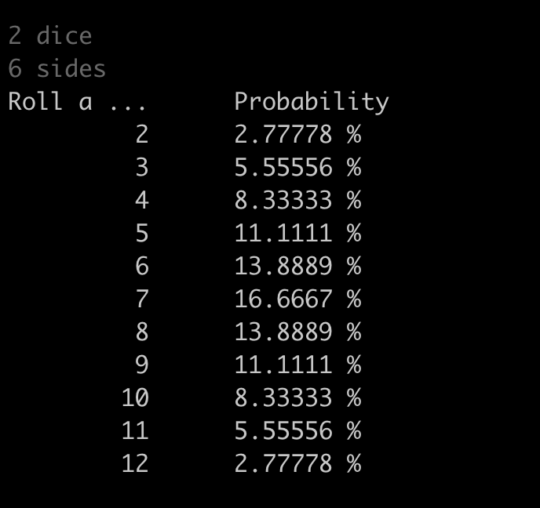
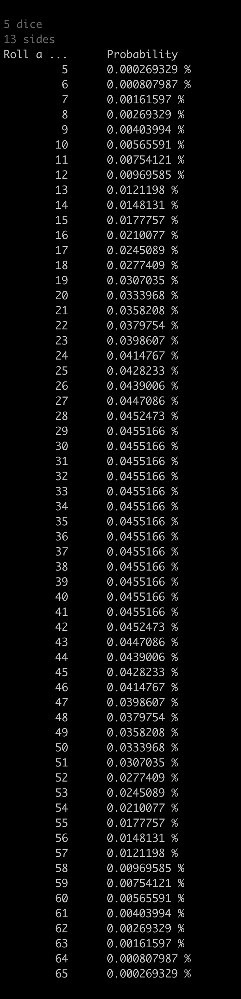

# Dice probability calculator

Calculates the probability of each possible sum when rolling N dice with S sides.

## Install

```sh
git clone https://github.com/itonyluke/dice dice
```

## Compile

```sh
clang++ dice.cpp
```

## Run

```sh
./a.out <number_of_dice> <number_of_sides>
```





Works on Linux, macOS, and Windows
