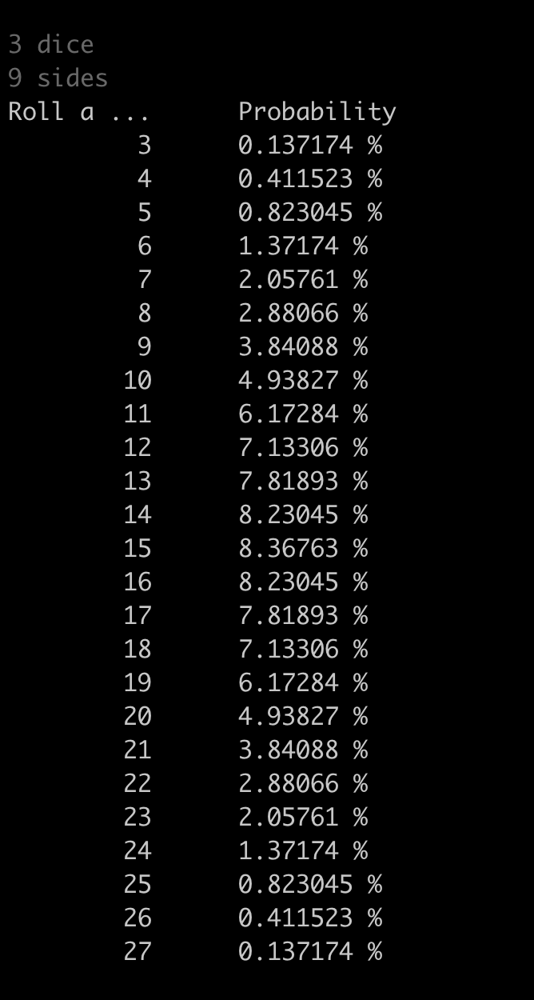

### this program calculates the probabilities for each sum while rolling different amount of dice with different amount of sides

#### install:
```
git clone https://github.com/itonyluke/dice dice
```

#### compile:
`clang++ dice.cpp`

#### run:
`./a.out <number_of_dice> <number_of_sides>`





###### built and tested on Darwin Kernel Version 18.7.0: Tue Jun 22 19:37:08 PDT 2021; root:xnu-4903.278.70~1/RELEASE_X86_64 x86_64
